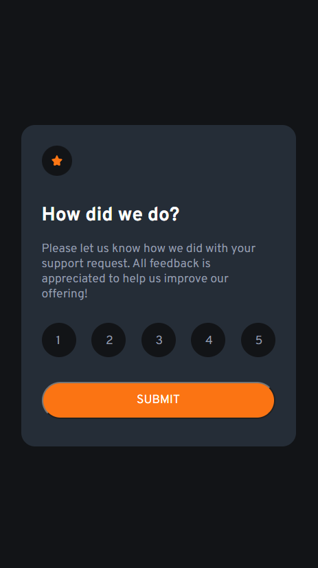
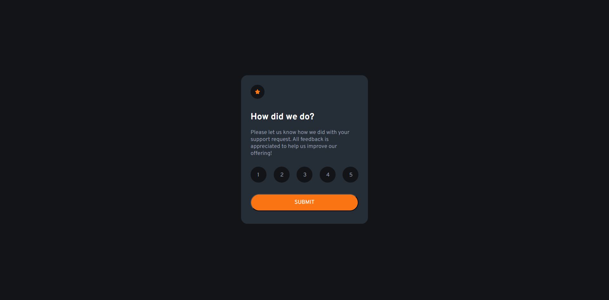

# Frontend Mentor - Interactive rating component solution

This is a solution to the [Interactive rating component challenge on Frontend Mentor](https://www.frontendmentor.io/challenges/interactive-rating-component-koxpeBUmI). Frontend Mentor challenges help you improve your coding skills by building realistic projects. 

## Table of contents

- [Overview](#overview)
  - [The challenge](#the-challenge)
  - [Screenshot](#screenshot)
  - [Links](#links)
  - [Built with](#built-with)
  - [What I learned](#what-i-learned)
- [Author](#author)

## Overview
The challenge requires a little knowledge of JS and DOM and the rest was pretty easy. The style-guide don't have some colors that were used in the design we were meant to follow, so I just used whatever color was available in the style-guide. 
I hope you'll find this solution helpful! 

### The challenge

Users should be able to:

- View the optimal layout for the app depending on their device's screen size
- See hover states for all interactive elements on the page
- Select and submit a number rating
- See the "Thank you" card state after submitting a rating

### Screenshot

- Mobile-view : 
- Desktop-view : 
- Working-video : 

### Links

- Solution repository URL: [https://github.com/varuno3/FEM-interactive-rating.git]
- Live Site URL: [https://varuno3.github.io/FEM-interactive-rating/]

### Built with

- Semantic HTML5 markup
- CSS custom properties
- Flexbox
- Mobile-first workflow
- localStorage object

### What I learned

I learned about using to localStorage object avaiable in JS to share data of one JS file with another JS file. 
You can see them being used in both my JS files.

## Author

- Name & Email - [Varun Badoni](varunbadoni987@gmail.com)
- Frontend Mentor - [@varuno3](https://www.frontendmentor.io/profile/varuno3)

